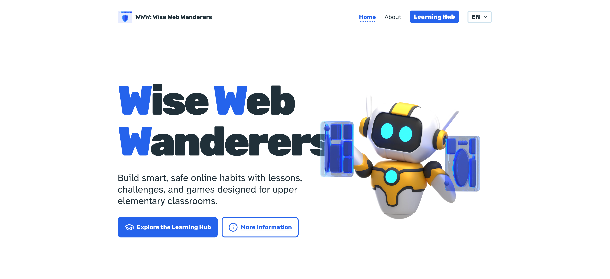

# WWW: Wise Web Wanderers

Wise Web Wanderers is an interactive cybersecurity education platform for upper elementary classrooms. It helps teachers and learners build safe, responsible online habits through structured modules, hands-on challenges, and game-based activities.

Live site: [https://hamersky-cshub.github.io/](https://hamersky-cshub.github.io/)

## Why This Project Matters

Children are online earlier and more often than ever. Schools need practical, age-appropriate cybersecurity materials that do not require specialist training to teach. Wise Web Wanderers addresses that gap with ready-to-use content designed for real classroom constraints.

## Key Points

- **Built for real classrooms**: Lessons are designed for upper elementary learners with age-appropriate language and scenarios.
- **Complete learning journey**: 7 modules cover digital citizenship, privacy, authentication, social engineering, malware, digital abuse, and attacker mindset.
- **Active learning, not passive reading**: Every module is paired with interactive challenges, and selected modules include games to reinforce retention.
- **Teacher-friendly implementation**: Materials are structured and reusable, so educators can deliver a full sequence or integrate individual modules.
- **Engagement with purpose**: Scenario-based challenges help students think critically, make decisions, and understand consequences.
- **Inclusive and scalable**: Resources are created to work across different teaching styles, technical skill levels, and school environments.
- **Internationally grounded**: Developed through collaboration among European universities and cybersecurity practitioners.
- **Multilingual access**: Available in 5 locales (`en`, `cs`, `de`, `lt`, `no`) to support broader adoption.

## Learning Experience At A Glance

- **7 Learning Modules**
- **7 Interactive Challenges**
- **5 Cybersecurity Games**
- **Classroom-ready flow**: `Content -> Challenge -> Game (where available)`

### Modules Included

1. Digital Citizenship
2. Attacker Perspective
3. Authentication
4. Data Privacy
5. Social Engineering
6. Malware
7. Digital Abuse

## Who Benefits

- **Educators**: Ready-to-use, flexible cybersecurity teaching materials without requiring deep technical expertise.
- **Students**: Practical digital safety skills through interactive and memorable learning experiences.
- **Schools and partners**: A scalable framework for improving cybersecurity literacy across diverse contexts.

## Collaboration

This is an open, evolving educational initiative. Feedback from educators, researchers, and practitioners is welcome to improve quality, classroom fit, and long-term impact.

## License

MIT License. See [LICENSE](LICENSE).
