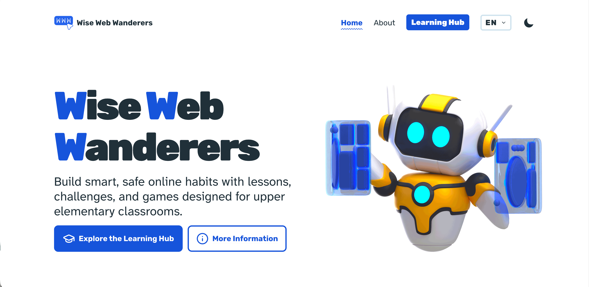
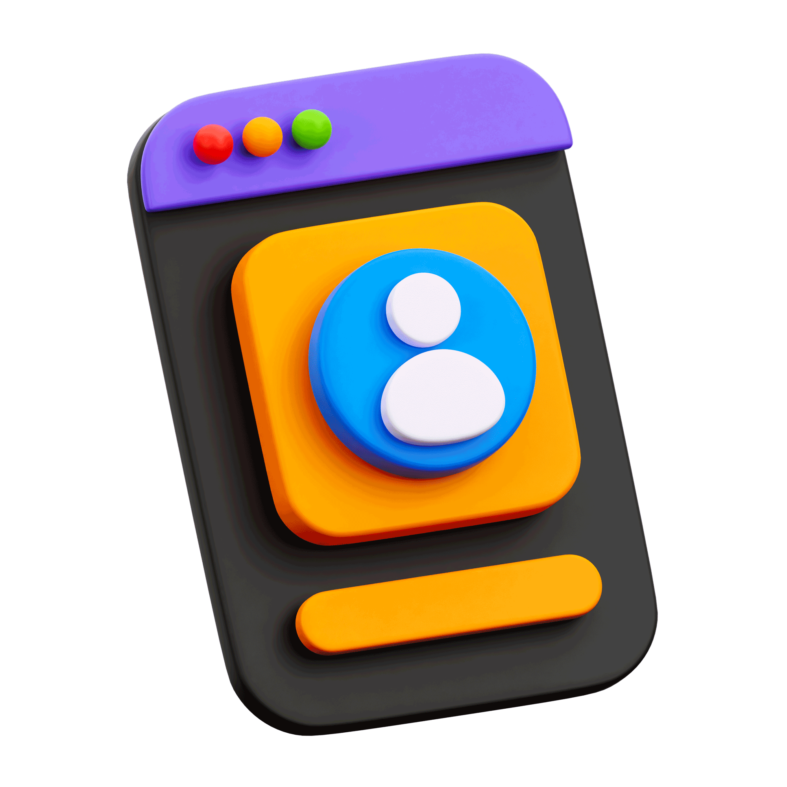
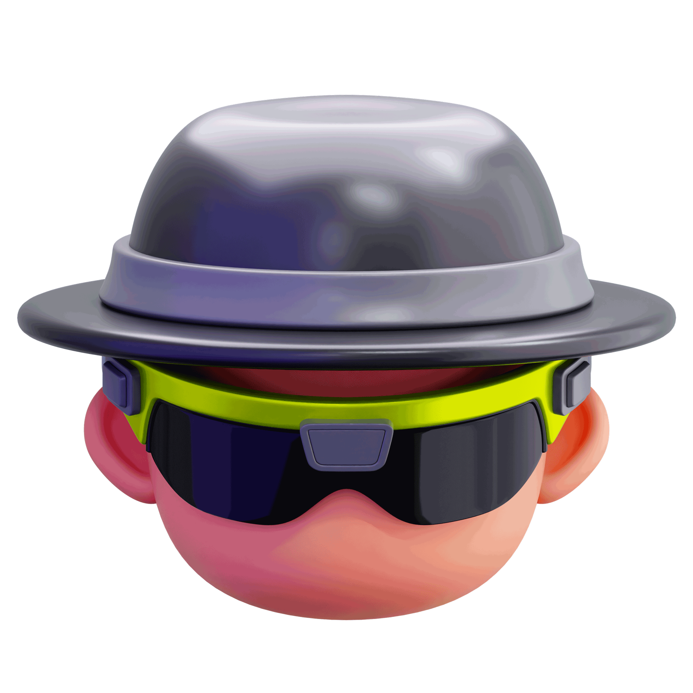
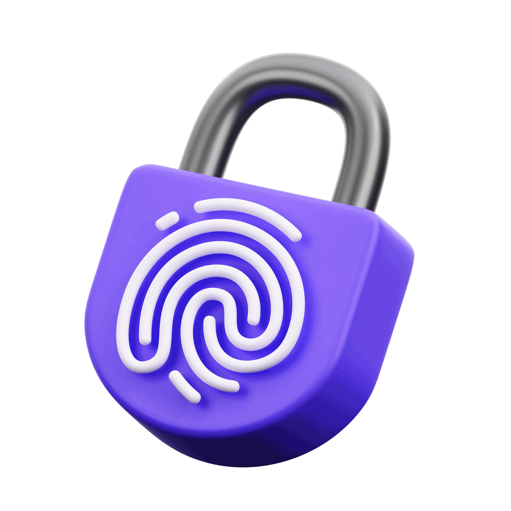
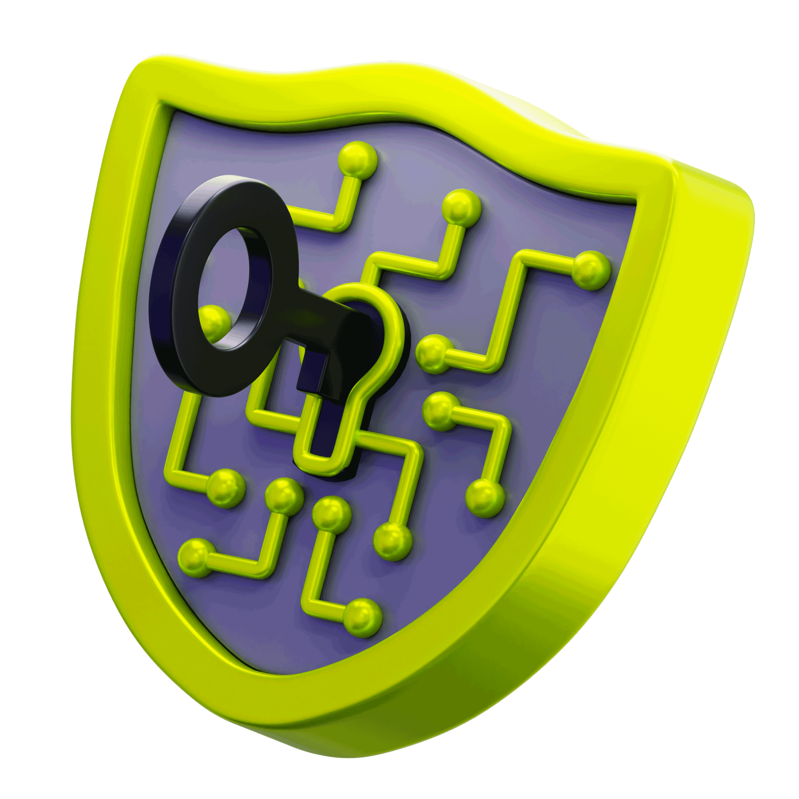
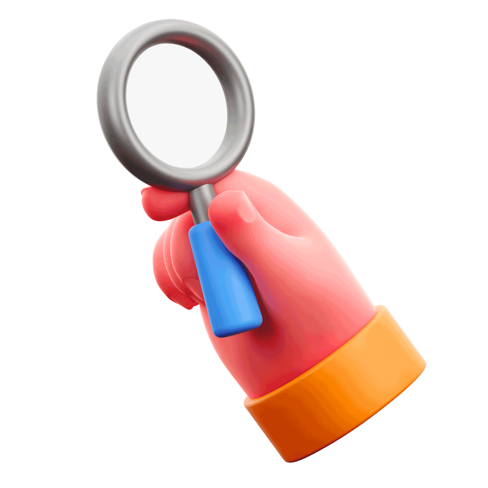
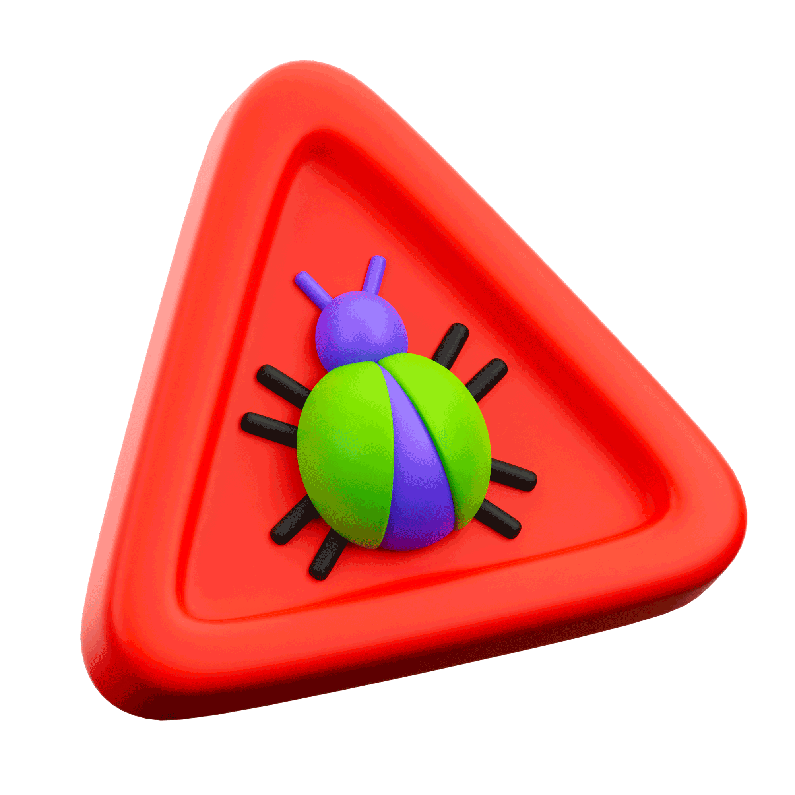

<div align="center">


# Wise Web Wanderers

**Ready-to-teach cybersecurity lessons, challenges and games for upper elementary classrooms**

[**🌐 Open the platform**](https://kidcyproject.github.io/) &nbsp;·&nbsp;
[**📚 Learning Hub**](https://kidcyproject.github.io/learning-hub/introduction/) &nbsp;·&nbsp;
[**ℹ️ About the project**](https://kidcyproject.github.io/about/)

[](#-the-seven-modules)
[](#-module-catalogue)
[](#-module-catalogue)
[](#-module-catalogue)
[](#-interactive-challenges)
[](#-cybersecurity-games-roblox)
[](#-languages)
[](LICENSE)



</div>

Wise Web Wanderers is a free, open cybersecurity education toolkit for **upper elementary learners**. It gives teachers everything needed to run lessons on safe, responsible online behaviour — lesson plans, printable materials, short videos, browser-based challenges and games — **without requiring specialist IT knowledge**.

> [!TIP]
> **New here?** Jump to [Quick start for educators](#-quick-start-for-educators) — you can be ready for your first lesson in about 15 minutes.

---

## 📑 Contents

- [Why this project matters](#-why-this-project-matters)
- [Key points](#-key-points)
- [Quick start for educators](#-quick-start-for-educators)
- [How the toolkit is organised](#-how-the-toolkit-is-organised)
- [The seven modules](#-the-seven-modules)
- [Module catalogue](#-module-catalogue)
- [Interactive challenges](#-interactive-challenges)
- [Cybersecurity games (Roblox)](#-cybersecurity-games-roblox)
- [Downloading materials](#-downloading-materials)
- [Languages](#-languages)
- [Planning your teaching](#-planning-your-teaching)
- [Classroom checklist](#-classroom-checklist)
- [FAQ](#-faq)
- [Who benefits](#-who-benefits)
- [Partners & funding](#-partners--funding)
- [Collaboration & feedback](#-collaboration--feedback)
- [For developers](#-for-developers)
- [License](#-license)

---

## 💡 Why this project matters

Children are online earlier and more often than ever. Schools need practical, age-appropriate cybersecurity materials that do not require specialist training to teach. Wise Web Wanderers addresses that gap with ready-to-use content designed for real classroom constraints.

## ✨ Key points

| | |
|---|---|
| 🏫 **Built for real classrooms** | Age-appropriate language and scenarios for upper elementary learners. |
| 🧭 **Complete learning journey** | 7 modules covering digital citizenship, attacker mindset, authentication, privacy, social engineering, malware and digital abuse. |
| 🙌 **Active learning** | Every module has an interactive challenge; five modules also have a game. |
| 🧑‍🏫 **Teacher-friendly** | Each module comes with a teaching guide, step-by-step activity plans and downloadable packages. Teach the full sequence or pick single parts. |
| 🎯 **Clear learning goals** | Every module states its aim, learning objectives and "I can…" learning outcomes. |
| 🌍 **Internationally grounded** | Developed by European universities and cybersecurity practitioners; aligned with the European Digital Competence Framework (DigComp). |
| 🗣️ **Multilingual** | Full platform in 5 languages, with video subtitles in all of them. |
| 💸 **Free and open** | MIT-licensed — use, adapt and share the materials freely. |

---

## 🚀 Quick start for educators

1. **Open the [Learning Hub](https://kidcyproject.github.io/learning-hub/introduction/)** and choose your language in the top navigation.
2. **Pick a module** (see [the seven modules](#-the-seven-modules)). Beginners usually start with *Digital Citizenship*.
3. **Download the Teaching Guide** at the top of the module page — it explains every material and how to use it.
4. **Read the module's aim, objectives and outcomes** so you know what students should be able to do afterwards.
5. **Choose a part** and open it to see its goal, activity plan, materials and video.
6. **Click "Download Package"** to get everything for that part in one ZIP — print worksheets and cards in advance.
7. **Test the video, challenge and game** on the classroom device before the lesson.
8. **Teach!** Close with the module's interactive challenge (and game, where available) to consolidate learning.

---

## 🧩 How the toolkit is organised

Every module follows the same predictable structure, so once you know one, you know them all:

```text
Module  (e.g. Authentication)
├── 📘 Teaching Guide ............ context and instructions for every material
├── 🎯 Aim · Objectives · Outcomes
├── 📦 Part 1 … Part N ........... one lesson unit each
│     ├── Goal of the part
│     ├── Activity plan .......... Introduction → Main activity → Plenary & informal assessment
│     ├── Materials .............. worksheets, scenario/sorting cards, images, posters, checklists
│     └── 🎬 Video (most parts) .. with downloadable subtitles in 5 languages
├── 🕹️ Interactive Challenge ..... browser-based, no install needed
└── 🎮 Game (5 modules) .......... played in the Roblox app
```

**Recommended classroom flow:**

```text
Teaching Guide  →  Parts (content + activities + video)  →  Interactive Challenge  →  Game (where available)
   prepare              teach                                  practise                  reinforce
```

---

## 🗺️ The seven modules

| # | | Module | What students learn | Parts | Challenge | Game |
|:-:|:-:|---|---|:-:|:-:|:-:|
| 1 |  | [**Digital Citizenship**](https://kidcyproject.github.io/learning-hub/digital-citizenship/content/) | What digital citizenship is and how to be safe, savvy and social online through rights, responsibility and respect. | 5 | ✅ | — |
| 2 |  | [**Attacker Perspective**](https://kidcyproject.github.io/learning-hub/attacker-perspective/content/) | Who attackers are, why they attack, and how to recognise their techniques. | 3 | ✅ | — |
| 3 |  | [**Authentication**](https://kidcyproject.github.io/learning-hub/authentication/content/) | Digital identity and assets, strong passwords, two-factor authentication and password managers. | 5 | ✅ | ✅ |
| 4 |  | [**Data Privacy**](https://kidcyproject.github.io/learning-hub/data-privacy/content/) | What personal data is, consent and sharing, and managing a digital footprint. | 4 | ✅ | ✅ |
| 5 |  | [**Social Engineering**](https://kidcyproject.github.io/learning-hub/social-engineering/content/) | Spotting manipulation (urgency, flattery, authority) and using a *Stop, Think, Check, Ask* routine. | 4 | ✅ | ✅ |
| 6 |  | [**Malware**](https://kidcyproject.github.io/learning-hub/malware/content/) | What malware is, its common types, warning signs and protective habits. | 4 | ✅ | ✅ |
| 7 |  | [**Digital Abuse**](https://kidcyproject.github.io/learning-hub/digital-abuse/content/) | Misinformation, disinformation, cyberbullying, stranger danger, influencers — and how to get help. | 6 | ✅ | ✅ |

---

## 📖 Module catalogue

Click a module to see its parts, videos and materials.

<details>
<summary><b>1 · Digital Citizenship</b> — 5 parts · 10 materials · 3 videos</summary>

**Aim:** To provide an understanding of what digital citizenship is and how to follow its core principles.

| Part | Title | Video | Materials |
|:-:|---|---|:-:|
| 1 | Digital Environments | 🎬 What Is a Digital Environment and Digital Systems? | 1 |
| 2 | What Does it Mean to be a Digital Citizen? | — | 2 |
| 3 | How to Stay Safe — Privacy Settings | 🎬 What Are Privacy Settings? | 4 |
| 4 | How to Act Savvy — Being Wise and Resilient | 🎬 Resilience in Digital Environments | — |
| 5 | How to Act Responsibly — Respecting Ourselves and Others | — | 3 |

**Challenge:** *GOOD or BAD Content to Post?* — students sort posts into what is safe and responsible to share.

**Students will be able to say:** *"I can explain what digital citizenship is and why it is important."*
</details>

<details>
<summary><b>2 · Attacker Perspective</b> — 3 parts · 15 materials · 1 video</summary>

**Aim:** To help learners recognise attacker techniques and understand the motives behind cyber-attacks.

| Part | Title | Video | Materials |
|:-:|---|---|:-:|
| 1 | Let Us Define the Circle of Trustees | — | 4 |
| 2 | What Is an Adversary? | 🎬 Who Is Behind Cyber Attacks? | 5 |
| 3 | What Are the Attacker Techniques? | — | 6 |

**Challenge:** *In Hacker's Mind* — students examine a social media profile as a hacker would, spotting the weak spots.

**Students will be able to say:** *"I can recognise attacker techniques in given scenarios."*
</details>

<details>
<summary><b>3 · Authentication</b> — 5 parts · 23 materials · 5 videos</summary>

**Aim:** To provide core knowledge of authentication and identity management principles for protecting personal digital assets.

| Part | Title | Video | Materials |
|:-:|---|---|:-:|
| 1 | What Is Identity and What Are Digital Assets? | 🎬 What Is Digital Identity? | 4 |
| 2 | What Is Authentication and Why Is It Important? | 🎬 What Is Authentication? | 3 |
| 3 | How to Create Strong Usernames and Passwords | 🎬 Strong and Weak Passwords | 5 |
| 4 | How to Manage Passwords Securely — Using a Password Manager | 🎬 What Is a Password Manager? | 8 |
| 5 | How to Protect Our Digital Identity — Safe and Responsible Choices | 🎬 Protecting Your Digital Identity | 3 |

**Challenge:** *Password Lab* — build a stronger password one round at a time.
**Game:** *Master Spell: Unlock the Vault* (Roblox).

**Students will be able to say:** *"I can distinguish between weak and strong usernames and passwords."*
</details>

<details>
<summary><b>4 · Data Privacy</b> — 4 parts · 14 materials · 3 videos</summary>

**Aim:** To help students recognise what counts as personal data, understand why privacy matters, and make safer choices before sharing information online.

| Part | Title | Video | Materials |
|:-:|---|---|:-:|
| 1 | What Is Private Data? | 🎬 What Is Private Data? | 2 |
| 2 | Data Sharing | — | 3 |
| 3 | Data Detectives — Digital Footprints | 🎬 What Is a Digital Footprint? | 4 |
| 4 | Data Detectives — Clean Up Your Digital Footprint | 🎬 Protecting Your Personal Data Online | 5 |

**Challenge:** *Digital Footprint Sorter* — sort everyday activities by the traces they leave online.
**Game:** *Secrets of the Pearl & Shell* (Roblox).

**Students will be able to say:** *"I can apply simple privacy rules before sharing or posting."*
</details>

<details>
<summary><b>5 · Social Engineering</b> — 4 parts · 14 materials · 2 videos</summary>

**Aim:** To help students recognise manipulation tactics, pause before acting, and choose safer responses when someone uses pressure, urgency, or false trust.

| Part | Title | Video | Materials |
|:-:|---|---|:-:|
| 1 | What Is Social Engineering? | 🎬 What Is Social Engineering? | 5 |
| 2 | Why Is Social Engineering Used by Attackers? | — | 3 |
| 3 | Recognising Social Engineering in Everyday Contexts | 🎬 Types of Social Engineering | 1 |
| 4 | Protecting Yourself and Others From Social Engineering | — | 5 |

**Challenge:** *Phishing Case Files* — become a Message Detective: trust it, or ignore/report it?
**Game:** *Scam or Safe? Don't Fall for It!* (Roblox).

**Students will be able to say:** *"I can use a pause-and-check routine before acting."*
</details>

<details>
<summary><b>6 · Malware</b> — 4 parts · 12 materials · 2 videos</summary>

**Aim:** To help students understand what malware is, how infections happen, and which habits reduce the risk of unsafe downloads, files, and installations.

| Part | Title | Video | Materials |
|:-:|---|---|:-:|
| 1 | What Is Malware? | 🎬 What Is Malware? | 3 |
| 2 | Malware Types | 🎬 Introducing Malware Types | 2 |
| 3 | Recognising Malware | — | 3 |
| 4 | Protection Measures Against Malware | — | 4 |

**Challenge:** *Malware Detective* — inspect files, emails, pop-ups and app permissions across 4 levels.
**Game:** *Malware Madness Race* (Roblox).

**Students will be able to say:** *"I can recognise warning signs of suspicious downloads."*
</details>

<details>
<summary><b>7 · Digital Abuse</b> — 6 parts · 13 materials · 4 videos</summary>

**Aim:** To help students recognise harmful online behaviour, understand that boundaries matter, and know the steps they can take to get support and stay safe.

| Part | Title | Video | Materials |
|:-:|---|---|:-:|
| 1 | Misinformation | 🎬 What Is Misinformation? | 2 |
| 2 | Disinformation | 🎬 What Is Disinformation? | 2 |
| 3 | Cyber Bullying | 🎬 What Is Cyber Bullying? | 2 |
| 4 | Stranger Danger | — | 3 |
| 5 | Influencers | 🎬 Social Media Influencers | 1 |
| 6 | How Can We Deal With the Behaviour of Digital Abusers? | — | 3 |

**Challenge:** *Real Talk Stories* — make choices, see consequences, learn how to handle cyberbullying and online pressure.
**Game:** *Kindness Quest: Save the City* (Roblox).

**Students will be able to say:** *"I know trusted adults and support channels to reach out to."*

> [!IMPORTANT]
> This module deals with sensitive topics such as bullying and online abuse. Read the teaching guide beforehand, follow your school's safeguarding procedures, and make sure students know who they can talk to.
</details>

---

## 🕹️ Interactive challenges

Challenges run **directly in the web browser** — no installation or account needed. They work on computers and tablets, give students immediate feedback, and reveal their reasoning, which makes them useful for **formative assessment**.

| Module | Challenge | What students do |
|---|---|---|
| Digital Citizenship | [GOOD or BAD Content to Post?](https://kidcyproject.github.io/learning-hub/digital-citizenship/challenge/) | Drag posts into "good" or "bad" to share |
| Attacker Perspective | [In Hacker's Mind](https://kidcyproject.github.io/learning-hub/attacker-perspective/challenge/) | Find the weak spots in a social media profile |
| Authentication | [Password Lab](https://kidcyproject.github.io/learning-hub/authentication/challenge/) | Build a stronger password round by round |
| Data Privacy | [Digital Footprint Sorter](https://kidcyproject.github.io/learning-hub/data-privacy/challenge/) | Sort activities by the traces they leave |
| Social Engineering | [Phishing Case Files](https://kidcyproject.github.io/learning-hub/social-engineering/challenge/) | Decide which messages are safe or phishing |
| Malware | [Malware Detective](https://kidcyproject.github.io/learning-hub/malware/challenge/) | Act as an analyst across 4 levels |
| Digital Abuse | [Real Talk Stories](https://kidcyproject.github.io/learning-hub/digital-abuse/challenge/) | Make choices and see their consequences |

## 🎮 Cybersecurity games (Roblox)

Five modules include a game that reinforces the module's key ideas through play. Use them as a warm-up, a reward, a full lesson activity or an optional take-home activity.

| Module | Game | In short |
|---|---|---|
| Authentication | [Master Spell: Unlock the Vault](https://kidcyproject.github.io/learning-hub/authentication/game/) | Choose stronger passwords, track the right knight (2FA), craft a Master Spell |
| Data Privacy | [Secrets of the Pearl & Shell](https://kidcyproject.github.io/learning-hub/data-privacy/game/) | Sort public vs private data, review posts, clean up a digital footprint |
| Social Engineering | [Scam or Safe? Don't Fall for It!](https://kidcyproject.github.io/learning-hub/social-engineering/game/) | Jump across platforms by spotting phishing correctly |
| Malware | [Malware Madness Race](https://kidcyproject.github.io/learning-hub/malware/game/) | Race three laps collecting protections and avoiding threats |
| Digital Abuse | [Kindness Quest: Save the City](https://kidcyproject.github.io/learning-hub/digital-abuse/game/) | Resolve conflicts about cyberbullying and deepfakes |

> [!WARNING]
> **Games require the Roblox app.** Clicking *Play* opens the game in Roblox; if it isn't installed, students are prompted to download it. Before class, check that:
> - Roblox is allowed by your school's IT and device policy,
> - the app is installed on classroom devices and the game opens,
> - you know how students will sign in (Roblox accounts are subject to Roblox's own terms and age requirements).
>
> If Roblox isn't an option, the **interactive challenges cover every module** and need only a browser.

---

## 📦 Downloading materials

You can download at whichever level suits you:

| Download | Where to find it | Contains |
|---|---|---|
| **Teaching Guide** | Top of each module page | Guidance for every material in the module |
| **Download All Materials** | Module page | Every part package of the module in one ZIP |
| **Download Package** | Each part | Worksheets, cards, images and video for that part |
| **Single material** | Each part's material list | One worksheet / card set / image |
| **Video + subtitles** | Under each video | The MP4 and subtitle files (`.vtt`) in all 5 languages |

> [!TIP]
> Downloaded videos with subtitles let you teach **offline** — handy if your classroom internet is unreliable. Most video players (e.g. VLC) can load `.vtt` subtitle files.

**Material types you will encounter:** worksheets, scenario cards, sorting cards, role cards, game cards, images and posters, schemas, checklists, comic stories, readings and situation assessments — most are designed to be **printed** for group or individual work.

---

## 🌐 Languages

The entire platform — lessons, materials, challenges and video subtitles — is available in:

| 🇬🇧 English | 🇨🇿 Čeština | 🇩🇪 Deutsch | 🇱🇹 Lietuvių | 🇳🇴 Norsk |
|:-:|:-:|:-:|:-:|:-:|
| [kidcyproject.github.io](https://kidcyproject.github.io/) | [/cs/](https://kidcyproject.github.io/cs/) | [/de/](https://kidcyproject.github.io/de/) | [/lt/](https://kidcyproject.github.io/lt/) | [/no/](https://kidcyproject.github.io/no/) |

Switch languages at any time with the language switcher in the navigation. Videos have English narration with subtitles in all five languages.

---

## 🗓️ Planning your teaching

Each part is a **self-contained lesson unit** with its own activity plan (typically: *Introduction → main activity → Plenary: summary and informal assessment*). Use the teaching guide to decide how much time each part needs for your class.

**Option A — Full programme (recommended).** Teach all 7 modules in order (31 parts). The sequence builds from general digital citizenship to specific threats:

```text
1 Digital Citizenship → 2 Attacker Perspective → 3 Authentication → 4 Data Privacy
                     → 5 Social Engineering → 6 Malware → 7 Digital Abuse
```

**Option B — Single module.** Pick one topic that fits your curriculum or a current issue in class (e.g. *Social Engineering* after a phishing incident).

**Option C — Individual parts.** Drop a single part into an existing ICT, citizenship or personal-development lesson.

**Option D — Challenge or game only.** Use a challenge as a quick formative check, an end-of-term review, or a homework task.

---

## ✅ Classroom checklist

**Before the lesson**
- [ ] Read the module's teaching guide and the part's activity plan
- [ ] Print the worksheets and cut out any cards
- [ ] Play the video on the classroom screen (or download it for offline use) and turn on subtitles in your language
- [ ] Try the challenge yourself; for games, check that Roblox works on the devices

**Equipment**
- 🖥️ Projector or large screen with speakers — for videos and whole-class discussion
- 💻 Computers or tablets with a modern web browser — for challenges (individually or in pairs)
- 🖨️ Printer — for worksheets and cards
- 🎮 Roblox app — only for the five games

**After the lesson**
- [ ] Use the plenary and the challenge results for informal assessment against the "I can…" outcomes
- [ ] Share your feedback with the project team (see [Collaboration](#-collaboration--feedback))

---

## ❓ FAQ

<details>
<summary><b>Do I need a technical or cybersecurity background?</b></summary>

No. The materials are written for teachers without specialist training. The teaching guide and activity plans walk you through each step.
</details>

<details>
<summary><b>What age group is this for?</b></summary>

Upper elementary learners. Adapt the pace and depth to your class — the modular structure makes it easy to shorten or extend.
</details>

<details>
<summary><b>Do students need accounts or to install anything?</b></summary>

Not for the lessons, videos or challenges — only a web browser. The games need the Roblox app.
</details>

<details>
<summary><b>Is it free? Can I adapt the materials?</b></summary>

Yes. Everything is free and released under the MIT License, so you may use, adapt and share it.
</details>

<details>
<summary><b>Can I use the materials without an internet connection?</b></summary>

Yes — download the part packages and videos (with subtitles) in advance. Challenges and games need an internet connection.
</details>

---

## 👥 Who benefits

- **Educators** — ready-to-use, flexible cybersecurity teaching materials without requiring deep technical expertise.
- **Students** — practical digital safety skills through interactive and memorable learning experiences.
- **Schools and partners** — a scalable framework for improving cybersecurity literacy across diverse contexts.

## 🤝 Partners & funding

Wise Web Wanderers is based on the **KidCy Project**, a collaboration between:

| Partner | Country |
|---|---|
| University of Liechtenstein | 🇱🇮 Liechtenstein |
| CyberSecurity Hub | 🇨🇿 Czechia |
| University of Inland Norway | 🇳🇴 Norway |
| University of Innsbruck | 🇦🇹 Austria |
| Vilnius University | 🇱🇹 Lithuania |


The project is co-funded by the European Union. Views and opinions expressed are those of the authors only and do not necessarily reflect those of the European Union.

## 💬 Collaboration & feedback

This is an open, evolving educational initiative. Feedback from educators, researchers and practitioners is welcome to improve quality, classroom fit and long-term impact.

- 🐞 Found an error or a translation issue? [Open an issue](https://github.com/KidCyProject/KidCyProject.github.io/issues).
- 🧑‍🏫 Used the toolkit in class? Tell us what worked and what didn't — via an issue or by contacting any of the [project partners](https://kidcyproject.github.io/about/).

---

## 📄 License

MIT License. See [LICENSE](LICENSE).
